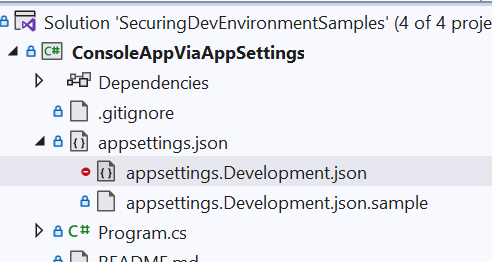

# Reading secrets from appsettings.Development.json

- keep your "development" secrets out of `appsettings.json` 
- use `appsettings.Development.json` instead
- add `appsettings.Development.json` to `.gitignore`
- (optional) add nesting in csproj to visually nest the settings files


downsides of this approach:
- secrets are store unencrypted in the settings file
- risk of checking in the file into source

## Add appsettings.Development.json to .gitignore

this will ensure you do not accidentally check in your secrets into source control



## Add file nesting 

add the following to .csproj

```xml
 <ItemGroup>
    <None Update="appsettings.Development.json">
      <DependentUpon>appsettings.json</DependentUpon>
    </None>
    <None Update="appsettings.Development.json.sample">
      <DependentUpon>appsettings.json</DependentUpon>
    </None>
  </ItemGroup>
  ```