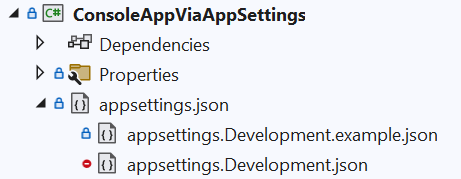

# Reading secrets from appsettings.Development.json

- keep your "development" secrets out of `appsettings.json` 
- use `appsettings.Development.json` instead
- ensure `appsettings.Development.json` to .gitignore` to minimize risk of accidentally being added to source control


## Checklist

- Add `appsettings.json` file
- Add `appsetting.Development.json` file
- On both files, set the `Copy to Output Directory` setting to `Copy if Newer` or `Always`
- Ensure the Environment varialble is set to `Development`
    - For console host apps, use `DOTNET_ENVIRONMENT`
    - For web apps, use `ASPNETCORE_ENVIRONMENT`
- :exclamation: add `appsettings.Development.json` to .gitignore
- (optional) add `appsettings.Development.json.sample` in csproj to visually nest the settings files
- (optional) add nesting in csproj to visually nest the settings files



## Add file nesting 

add the following to .csproj

```xml
 <ItemGroup>
    <None Update="appsettings.Development.json">
      <DependentUpon>appsettings.json</DependentUpon>
      <CopyToOutputDirectory>PreserveNewest</CopyToOutputDirectory>
    </None>
   <None Update="appsettings.Development.example.json">
     <DependentUpon>appsettings.json</DependentUpon>
     <CopyToOutputDirectory>PreserveNewest</CopyToOutputDirectory>
   </None>
  </ItemGroup>
  ```

## Pros and Cons of storing Dev secrets in appsettings.Development.json

### Pros

- **More secure than in appsettings.json**: A level more 'secure' than storing them in directly `appsettings.json`.
- **Convenience**: Easy to manage and access configuration settings.

### Cons

- **Risk of Exposure**: If the settings file is accidentally checked into source control, sensitive information can be exposed.
- **Secrets are stored unencrypted** in the settings file on the local drive, which can pose a security risk
