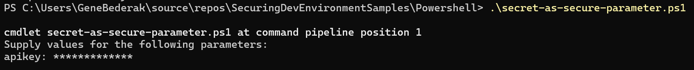

# Using secrets with Powershell scripts

Developers often need to use secrets in their powershell scripts.  Secrets are sensitive information that should be protected. 

The samples below are written in powershell, but the concepts can apply to ther scripting languages.

Assume a script that uses a secret API Key to connect to an API.

## Store the key right in the script

The secret key is hard-coded in clear text into the script. This is often how scripts are initially coded in their early stages where security is not considered at all.   

```powershell
### hardcoded-secret.ps1

$apikey = "1234567890"
# connect to some API using the key

Write-Host "The provided API key is: apikey"  # For demonstration, we'll just print the APIKey value
```

invoked with...
```
.\connect-to-api.ps1 
```
Not secure because...

- the secret key, along with ps1 script file is saved unencrypted on local file system
- file can easily be checked into source control

______
## Secret as Parameter

in the example below, the apiKey is passed as a parameter to the script.  this is a more secure way to pass the secret to the script.  the secret is not stored in the script file.  the secret is passed as a parameter when the script is called.


```powershell
### script-as-parameter.ps1

param (
    [Parameter(Mandatory=$true)]
    [string]$apikey
)

# Script logic goes here

Write-Host "The provided API key is: apikey"  # For demonstration, we'll just print the APIKey value
```

however,there are various ways to pass the secret to the script.  Some methods more secure than others...


### Secret Passed as a Parameter
pass secret as parameter when calling script
```
.\secret-as-parameter.ps1 -apikey 1234567890
```

### Parameter omitted and powershell prompts

If you omit secret from call, PowerShell's default behavior is to prompt the user for the missing parameters. 

```
.\secret-as-parameter.ps1
```

the result is...


- Secret is still visible in the command history.
- script need to be execute interatively
- you still need to remember or store the key somewhere to type it in (so where are you storing it?)

note: (run the command again and press the "up" arrow key to see the secret in the command history)


### Parameter (Securestring) omitted and let powershell prompt

```powershell
### secret-as-secure-parameter-ps5.ps1

param (
    [Parameter(Mandatory=$true)]
    [System.Security.SecureString]$apikey
)

$credential = New-Object System.Net.NetworkCredential("", $apikey)
$plainTextKey = $credential.Password

Write-Host "The provided API key is: $plainTextKey"  # For demonstration, we'll just print the APIKey value
```
As in the previous example, PowerShell's default behavior is to prompt the user for the missing parameters, however there the parameter is of type Securestring 

```
.\secret-as-secure-parameter-ps5.ps1
```

the result is...




- works in powerhsell 5.1
- script need to be execute interatively
- you still need to remember or store the key somewhere to type it


______

## Option: Store and Read Secret from Windows Credential Store


_______
## Option: Read Secret from Environment Variable at Invocation

the secret is read from environment variable when needed

```powershell
### script.ps1

$apikey = [System.Environment]::GetEnvironmentVariable('API_KEY', 'User')

# connect to some API using the key

Write-Host "The provided API key is: apikey"  # For demonstration, we'll just print the APIKey value
```
```
.\connect-to-api.ps1 
```

Attributes

- no risk of being checked into repo

__
## as


## environment variable

### option 1
```
$myApiKey = [System.Environment]::GetEnvironmentVariable('API_KEY', 'User')
```

In this script, API_KEY is the name of the environment variable. This method keeps your API key out of the script and source control.


### option 2

```
.\connect-to-api.ps1 -apikey ([System.Environment]::GetEnvironmentVariable('API_KEY', 'User'))
```


references: https://www.itprotoday.com/powershell/how-manage-credentials-powershell
