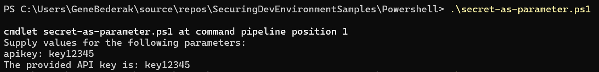

# Powerhsell secrets


## store the key in the script

key is hard-coded into the script. usually how scripts are initially coded

```powershell

$apikey = "1234567890"
# connect to some API using the key

Write-Host "The provided API key is: apikey"  # For demonstration, we'll just print the APIKey value
```
```
.\connect-to-api.ps1 
```
Not secure because...

- saved unencrypted on local file system
- saved inside of the script
- can easyly be checked in to repo

______

## read envronment variable 

pass secret as parameter when calling script

```powershell

$apikey = System.Environment]::GetEnvironmentVariable('API_KEY', 'User')

# connect to some API using the key

Write-Host "The provided API key is: apikey"  # For demonstration, we'll just print the APIKey value
```
```
.\connect-to-api.ps1 
```

Attributes

- key pulled from environment variable
- tightly coupled to environment variable
- no risk of being checked into repo

______

## make the key passed as a parameter

```powershell
param (
    [Parameter(Mandatory=$true)]
    [string]$apikey
)

# Script logic goes here

Write-Host "The provided API key is: apikey"  # For demonstration, we'll just print the APIKey value
```

this 

```
.\connect-to-api.ps1 
```

## non-secure way

pass secret as parameter when calling script

```
.\connect-to-api.ps1 -apikey 1234567890
```

- saved in powershell history

## non-secure way

omit secret from call, powershell will prompt.  this works when executing the script manualy/interactively.  but you still need to remember or store the key somewhere to type it

```
.\connect-to-api.ps1 
```
the result is...




## environment variable

### option 1
```
$myApiKey = [System.Environment]::GetEnvironmentVariable('API_KEY', 'User')
```

In this script, API_KEY is the name of the environment variable. This method keeps your API key out of the script and source control.


### option 2

```
.\connect-to-api.ps1 -apikey ([System.Environment]::GetEnvironmentVariable('API_KEY', 'User'))
```


